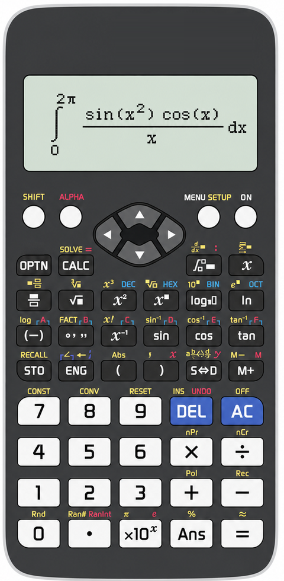

# Scientific Calculator 1.0.3

<p align="center">
  
  <br>
  <strong>I dedicate this program to my cat, Nizamettin, and my bird, Mamıd.</strong>
</p>

<p align="center">
  
</p>

<p align="center">
  A desktop scientific calculator for Windows with a classic scientific-calculator-inspired interface,
  advanced calculation modes, responsive UI scaling, and offline operation.
</p>

---

## Overview

**Scientific Calculator 1.0.3** is an open-source Windows desktop calculator designed for scientific, engineering, and mathematical workflows.

The application combines a familiar physical-calculator-style interface with desktop convenience. It supports standard scientific calculations as well as calculus, equations, matrices, vectors, statistics, tables, complex numbers, and additional calculation modes.

The application works fully offline and does not require an internet connection for normal calculations.

User guides: [English](USER_GUIDE.md) · [Türkçe](KULLANIM_KILAVUZU.md).

To report a security issue privately, see [SECURITY.md](SECURITY.md).

## Interface and independence notice

Scientific Calculator is **not an emulator, firmware clone, or affiliated product of any calculator manufacturer**. It is an independent calculation tool with its own open-source implementation. The interface is designed to present that functionality through the familiar, widely recognized layout conventions of classic scientific calculators; it does not reproduce proprietary firmware or claim compatibility with a specific brand or model.

## Features

- Scientific and engineering calculations
- Trigonometric and inverse trigonometric functions
- Hyperbolic and inverse hyperbolic functions
- Logarithmic and exponential functions
- Fractions, powers, roots, factorials, and combinatorics
- Numerical and symbolic calculus support
  - Definite and convergent improper integrals (`inf`, `∞`, `-inf`, `-∞`)
  - Indefinite integrals
  - Derivatives
  - Complex definite, double, and parameterized contour integrals
  - Double and triple integrals with finite nested bounds
  - Scalar and vector planar line integrals over parameterized paths
  - Scalar surface integrals and oriented surface flux integrals over parameterized patches
- Equation solving, including symbolic first- and second-order ordinary differential equations
- Complex number calculations
- Base-N calculations
- Matrix calculations
- Vector calculations
- Statistics
- Probability distributions
- Spreadsheet mode
- Function table mode
- Equation / Function mode
- Inequality mode
- Ratio calculations
- Configurable number and angle formats
- Responsive calculator interface
- Four selectable calculator skins: Graphite, Blue, Pink, and White
- Persistent application settings
- Persistent last-10 calculation history, browsable on the LCD with `▲` / `▼` (`1` is the newest entry)
- Offline operation

## Calculation Modes

Scientific Calculator includes the following main modes:

1. Calculate
2. Complex
3. Base-N
4. Matrix
5. Vector
6. Statistics
7. Distribution
8. Spreadsheet
9. Table
10. Equation / Function
11. Inequality
12. Ratio

## Scientific constants

Setup lets you choose between **Legacy CODATA 2010 (compatibility)**, which preserves the original calculator values, and **Current CODATA 2022**. `CONST` always labels the selected catalogue. The current catalogue follows [NIST's CODATA 2022 recommended values](https://physics.nist.gov/cuu/Constants/index.html); the legacy option remains available so older calculations are reproducible.

## Persistent Settings

Application settings can be saved directly from the calculator.

Saved preferences include the UI scale, selected calculator skin, and calculator setup options. Settings are stored as typed values in `%LOCALAPPDATA%\ScientificCalculator\settings.db` using SQLite; no JSON, pickle, `shelve`, or `dbm` data is read. If `LOCALAPPDATA` is unavailable, the fixed fallback is `%USERPROFILE%\.scientific_calculator\ScientificCalculator\settings.db`. The application only opens these app-controlled locations; it does not import user-selected settings files. Stored values are validated against the supported Setup choices, and invalid or damaged values fall back safely to in-memory defaults without overwriting the database.

The application also saves the active configuration when it closes normally. The last 10 successful calculations—including integrals, derivatives, summations, and SOLVE results—and their displayed results are stored locally in the same SQLite database. Open `MENU` → `History` to browse them directly on the LCD with `▲` / `▼`; no separate window is opened. Setup's **Clear History** removes only those saved calculations after confirmation; **Reset to Defaults** also clears settings. Common parenthesis-free trigonometric products such as `sinxcosx` are accepted as `sin(x)×cos(x)`.

In **Calculate** and **Complex** modes, `∫` opens an LCD-only calculus chooser; it never opens a dialog window. Use `◀` / `▶` to choose an operation and `=` to enter its fields. Calculate offers definite and indefinite integrals, symbolic derivatives, double/triple integrals, scalar or vector line integrals, and scalar or flux surface integrals. Complex offers definite and indefinite integrals, complex double integrals, and contour integrals. The differential variables, integration order, bounds, path or patch parameters, and flux orientation are configurable. Nested multi-variable bounds must be finite; an inner bound may use only the variables of outer integrations. Every successful operation is written to the same persistent History list.

**Equation / Function** also includes an LCD-only symbolic ordinary-differential-equation solver for first- and second-order equations. Choose the dependent and independent variables, enter notation such as `dy/dx=y` or `d2y/dx2+y=0`, and optionally supply initial conditions. Use `y(x0)` for a first-order initial-value problem; a second-order initial-value problem also needs `y'(x0)`.

**Reset to Defaults** clears the saved configuration and calculation history, then restores the default calculator settings. It is a Setup-only action: the `ON` key performs a normal application restart and preserves saved settings.

Settings and calculation history are committed together in one SQLite transaction. Database schema and settings-data versions are separate migration gates, so a failed write cannot be reported as a successful settings change.

Long SymPy calculations run in one controller-owned process with a 30-second wall-clock limit. During a calculation, the display shows `Calculating…` and only `AC` (or Escape) is accepted; cancellation returns the calculator to its normal clean state immediately. A timed-out or cancelled operation never changes `Ans` or History.

## Error behavior

Calculation, input, and settings errors are shown on the calculator LCD, not in a separate error popup. The active input is cleared, the current mode is preserved, successful `Ans` and History values remain intact, and a new calculation can be entered immediately. All user-facing error text is English; legacy engine messages are translated at the desktop boundary. Unexpected internal failures are logged and show `Internal ERROR` on the LCD.

No cloud account or online service is required.

## Security Hardening

The mathematical expression parser is hardened while preserving calculator syntax.

- SymPy token transformations feed a restricted arithmetic interpreter; Python `eval` and builtins are not used.
- Non-mathematical characters, attribute access, Python keywords, and non-whitelisted names are rejected before parsing.
- Implicit multiplication such as `2x` and `(x+1)(x-1)` remains supported.
- Products, quotients, powers, roots, equations, SOLVE, integrals, derivatives, and single-letter equation variables remain supported.
- Raw expression, batch, exponent, and exact-intermediate budgets bound resource use before display formatting.

As with any mathematical application, users should install binaries from the official project release and verify published hashes when available. See [third-party notices](THIRD_PARTY_NOTICES.md) for the pinned runtime and build dependencies.

## Percent key behaviour

The percent symbol means “divide this value by 100.” For example, `10%` evaluates to `0.1`. It is not a contextual retail-calculator operation, so `200 + 10%` means `200.1`, not `220`.

## Result Formatting

The calculator supports exact symbolic output and configurable numeric output. Depending on the selected mode and settings, results may be displayed as fractions, radicals, decimal values, scientific notation, or complex numbers.

Numeric formatting options include **Norm**, **Fix**, and **Sci**, with selectable digit precision. Complex numeric output follows the same selected numeric formatting and supports `a+bi` and polar `r∠θ` display modes.

---

## Installation

1. Download `ScientificCalculator_Setup.exe`.
2. Run the installer.
3. Choose the installation location.
4. Keep the preselected desktop-shortcut option or clear it if you do not want one.
5. Complete the setup wizard.
6. Launch **Scientific Calculator**.

The installer is generated with **Inno Setup**.

During uninstall, the application files, shortcuts, and every fixed application-data folder (`%LOCALAPPDATA%\ScientificCalculator` plus the `%USERPROFILE%\.scientific_calculator\ScientificCalculator` fallback) are removed. This clears settings, history, SQLite sidecars, and diagnostic logs so a later installation starts with no retained Scientific Calculator data. If you select an existing installation folder, unrelated files already in that folder are preserved.

## Experimental Linux and macOS packages

Public releases may also include Linux and macOS packages produced by GitHub Actions. They are clearly marked **Not tested**: they are built and smoke-tested in CI, but have not been manually tested on a Linux or macOS device. They are unsigned, so test them before relying on them for important work.

The macOS build creates a native `.icns` application icon from the project icon. On macOS, a selected UI scale that would exceed the current display work area is reduced to the largest supported scale that keeps the full calculator visible; this avoids a cropped Canvas on Retina/laptop displays.

- `ScientificCalculator-linux.tar.gz` — extract, then run `./ScientificCalculator`.
- `ScientificCalculator-macos-intel.zip` — Intel Mac application bundle.
- `ScientificCalculator-macos-apple-silicon.zip` — Apple Silicon (M-series) application bundle.

---

## Run from Source

### Requirements

- Windows
- Python 3.12
- pip

Clone or download the repository, open PowerShell in the project directory, and install the dependencies:

```powershell
py -m pip install -e .
```

Run the application:

```powershell
py -m scientific_calculator
```

### Python Dependencies

The project currently uses:

- SymPy
- SciPy
- NumPy
- Pillow

[`pyproject.toml`](pyproject.toml) is the canonical dependency and package definition. [`requirements.txt`](requirements.txt) and [`requirements-dev.txt`](requirements-dev.txt) are pinned compatibility lists for non-editable installs.

### Project Structure

```text
src/scientific_calculator/  Application package and runtime code
  calculator_engine.py      Parser, calculation modes, and stateful engine facade
  calculus.py               Real, complex, and contour integral policy
  numeric_validation.py     Shared finite-number validation
  calculation_controller.py Cancellable Tk-process coordination
assets/                     Branding, icons, skins, and installer artwork
packaging/windows/          Windows installer script and executable metadata
tests/                      Automated regression tests
```


---

## Build the Windows Executable

From the project root, run:

```powershell
py -m PyInstaller --noconfirm --clean --onedir --windowed --name ScientificCalculator --icon assets\icons\app.ico --hidden-import numpy.random._generator --collect-all numpy --collect-all scipy --version-file packaging\windows\version_info.txt --add-data "assets\skins\skin_graphite.png;skins" --add-data "assets\skins\skin_blue.png;skins" --add-data "assets\skins\skin_pink.png;skins" --add-data "assets\skins\skin_white.png;skins" --add-data "assets\icons\app.ico;icons" --paths src src\scientific_calculator\__main__.py
```

The compiled executable will be created at:

```text
dist\ScientificCalculator\ScientificCalculator.exe
```

PyInstaller may also create temporary build files such as `build/` and `ScientificCalculator.spec`. These do not need to be included in the public source repository.

## Build the Installer

Install **Inno Setup 6**, then open:

```text
packaging\windows\installer.iss
```

Choose:

```text
Build → Compile
```

The installer will be created at:

```text
dist\ScientificCalculator_Setup.exe
```

---

## Default Configuration

The application starts with practical scientific-calculator defaults, including:

- Angle unit: **RAD**
- Result format: **Fix 3**
- UI scale: **100%**
- Skin: **Graphite**

These options can be changed from the calculator's setup menu and saved for future sessions.

## Privacy and Offline Use

Scientific Calculator is designed to operate locally.

- Calculations are performed on the user's computer.
- Normal calculator operation does not require an internet connection.
- Application settings are stored locally.
- No account is required.

---

## Development Notes

When modifying the interface, **100% scale should remain the reference layout**. Changes to the LCD, fonts, cursors, calculus templates, or calculator skin should remain proportional at every supported scale.

When modifying calculation behavior, test both direct calculations and the relevant calculator mode before publishing a release.

The expression parser is intentionally restricted. New mathematical functions should be added explicitly to the calculator's parser whitelist instead of exposing Python builtins or a broad SymPy namespace.


## Tests

Install the pinned development tools and run lint, branch coverage, and the regression suite from the repository root:

```powershell
py -m pip install -e ".[dev]"
py -m ruff check src tests
py scripts/requirements_sync_check.py
py -m pytest -q --cov --cov-report=term-missing
py -m pyright
```

The CI quality gate uses branch coverage with a 65% floor and Pyright for the controller/worker/persistence modules. Linux CI runs the live Tk regression suite through Xvfb, while other environments may run the same tests only when a desktop is available. Critical engine, persistence, controller, calculus, and numeric-validation paths have dedicated regression tests. Coverage is increased through executable behavior tests only; no source exclusions are used to inflate it.

## License

Scientific Calculator is released as open-source software under the **MIT License**.

See [`LICENSE`](LICENSE) for the complete license text.
