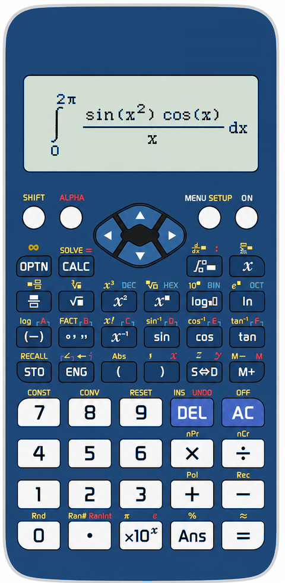

# Scientific Calculator 1.0.0

<p align="center">
  
</p>

<p align="center">
  An offline desktop scientific calculator for Windows, Linux, and macOS.
</p>

Scientific Calculator is an open-source desktop calculator for scientific, engineering, and mathematical work. It keeps mathematical input and completed results on a calculator LCD, is fully navigable from the keyboard, and runs entirely offline: no account, no telemetry, and no network access during normal use.

## Download

Choose the installer for your operating system and processor. Each link starts the matching 1.0.0 download directly.

| Device | Installer |
| --- | --- |
| Windows — Intel/AMD 64-bit | [Download](https://github.com/workaybarsh/ScientificCalculator/releases/download/windows-x64-v1.0.0/ScientificCalculator_Setup_x64.exe) |
| Windows — ARM64 | [Download](https://github.com/workaybarsh/ScientificCalculator/releases/download/windows-arm64-v1.0.0/ScientificCalculator_Setup_arm64.exe) |
| macOS — Intel | [Download](https://github.com/workaybarsh/ScientificCalculator/releases/download/macos-intel-x64-v1.0.0/ScientificCalculator_Setup_macos-intel-x64.pkg) |
| macOS — Apple silicon | [Download](https://github.com/workaybarsh/ScientificCalculator/releases/download/macos-arm64-v1.0.0/ScientificCalculator_Setup_macos-m-series.pkg) |
| Linux — Intel/AMD 64-bit | [Download](https://github.com/workaybarsh/ScientificCalculator/releases/download/linux-x86_64-v1.0.0/ScientificCalculator-linux-x86_64.deb) |
| Linux — ARM64 | [Download](https://github.com/workaybarsh/ScientificCalculator/releases/download/linux-arm64-v1.0.0/ScientificCalculator-linux-arm64.deb) |

Every release also publishes a portable direct-run package and a SHA-256 checksum. Verify the checksum before running a downloaded file. Installation, portable use, and complete removal are described in [Install, run, and remove](docs/INSTALLATION.md).

## Documentation

| Document | Contents |
| --- | --- |
| [Interface Tour](docs/INTERFACE.md) | Control-by-control explanation of the calculator face |
| [Install, run, and remove](docs/INSTALLATION.md) | Platform packages, checksum verification, and removal |
| [User guide](USER_GUIDE.md) · [Kullanım kılavuzu](KULLANIM_KILAVUZU.md) | Complete operating instructions in English and Turkish |
| [Architecture](docs/ARCHITECTURE.md) | Application layers and the import rules between them |
| [Security policy](SECURITY.md) | Supported releases, private reporting, and security boundaries |
| [Contributing](CONTRIBUTING.md) | Development checks, build commands, and release validation |

## Features

- Scientific, trigonometric, hyperbolic, logarithmic, and exponential functions
- Numerical and symbolic calculus: definite, indefinite, improper, double, and triple integrals; derivatives; limits; and first- and second-order linear ordinary differential equations
- Equation solving, matrices, vectors, statistics, regression, and probability distributions
- Complex numbers, Base-N arithmetic, unit conversion, and scientific constants
- Spreadsheet, function table, and inequality workspaces
- Exact symbolic output alongside Norm, Fix, and Sci numeric formatting
- Four calculator skins, eight UI scales, and persistent settings and history
- Offline operation with local SQLite storage

## Calculation modes

Calculate · Complex · Base-N · Matrix · Vector · Statistics · Distribution · Spreadsheet · Table · Equation/Function · Inequality · Ratio

## Run from source

Requires Python 3.12 and a graphical desktop on Windows, Linux, or macOS.

```powershell
py -m pip install -e .
py -m scientific_calculator
```

## Security

The expression parser is deliberately restricted. SymPy token transformations feed a restricted arithmetic interpreter; Python `eval`, builtins, attribute traversal, and non-allowlisted names are never reachable. Expression size, exponent, factorial, combinatoric, and exact-result budgets bound resource use before display. Settings and history are stored as typed SQLite values in an application-controlled location and are never deserialized from a user-selected file.

Report a vulnerability privately through [GitHub's advisory form](https://github.com/workaybarsh/ScientificCalculator/security/advisories/new); see [SECURITY.md](SECURITY.md). Pinned runtime and build dependencies are listed in [third-party notices](THIRD_PARTY_NOTICES.md).

## Independence notice

Scientific Calculator is not an emulator, firmware clone, or affiliated product of any calculator manufacturer. It is an independent implementation that presents its own functionality through the widely recognized layout conventions of classic scientific calculators. It does not reproduce proprietary firmware and does not claim compatibility with any specific brand or model.

## Code signing

A code-signing certificate is not currently available to this project, so the published Windows, Linux, and macOS packages are **not code-signed** and the macOS packages are not notarized. Operating systems will warn about an unidentified publisher on first run. Verify the SHA-256 checksum published with each release before running a downloaded file; it is the integrity check this project does provide.

## License

Released under the MIT License. See [`LICENSE`](LICENSE) for the full text.

## Dedication

<p align="center">
  
  <br>
  <strong>I dedicate this program to my cat, Nizamettin, and my bird, Mamıd.</strong>
</p>
