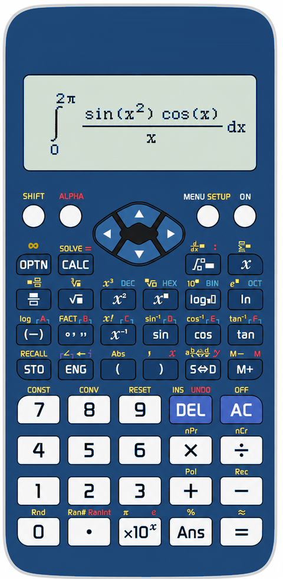

# Interface tour

  

Scientific Calculator uses one calculator-shaped desktop window. The image above is the current **Blue** skin itself, used directly as the project promotional image: the large LCD occupies the top of the calculator, the navigation pad is centred under it, and all calculation workspaces remain inside the LCD rather than opening a separate result window.

## LCD layout

The narrow top LCD line shows the active mode, angle unit, and number base. The input or active template is shown below it; results use the lower LCD row.

- `◀` and `▶` move between template fields or pan text that does not fit on the LCD.
- `▲` and `▼` move between result rows, History records, and vertically arranged input layers.
- `=` accepts the current expression, commits a completed row in a multi-row template, or evaluates the operation.
- `AC` cancels a running calculation and returns the active workspace to a clean state.
- Long text stays in its own LCD field. An ellipsis (`…`) means there is more text to inspect with `◀` / `▶`.

## Key map

| Control | What it does |
| --- | --- |
| `MENU` | Opens the main-mode navigator: Calculate, Complex, Base-N, Matrix, Vector, Statistics, Distribution, Spreadsheet, Table, Equation / Function, Inequality, and Ratio. Changing mode first clears the former LCD workspace. |
| `SHIFT + MENU` | Opens the Setup window for skin, scale, formatting, constants, and saved preferences. |
| `∫` | In **Calculate** or **Complex** only, clears the prior LCD state and opens the integral chooser/template. It has no calculus action in other modes. |
| `SHIFT + ∫` | Opens the derivative template in **Calculate** or **Complex**. An empty point gives the derivative function; a filled point evaluates the derivative there. |
| `SHIFT + OPTN` | Enters `∞`, useful for an improper integral bound. |
| `OPTN` | Opens the current workspace's operation choices; in History, recalls the selected raw expression. |
| `DEL` | Deletes the character immediately to the left of the cursor. |
| `SHIFT + AC` / OFF | Saves active preferences and exits the application. |
| `ON` | Performs a normal restart while retaining saved preferences. |

## Mathematics stays on the LCD

Integral, derivative, polynomial, simultaneous-equation, and differential-equation screens are deliberately LCD templates rather than nested dialog boxes. The active square has the editing cursor; move through squares with `◀` / `▶`.

- A real integral has editable expression, bounds, and `d□` variable. Leave **both** bounds empty for a symbolic result with `+ C`; fill **both** for a definite result.
- Double and triple integrals make every nested bound and differential-variable field separately reachable. Bounds may use an already-bound outer variable.
- A complex integral keeps `dz` fixed and starts with empty integrand and bounds.
- The ODE form is `□·y'' + □·y' + □·y = □`; it is arranged across roomy LCD rows so its boxes do not overlap. Enter the four expressions left to right and press `=`.
- Polynomial roots and solved simultaneous systems present `x1`, `x2`, and further values on separate `▲` / `▼`-browsable result rows.

## Appearance and scale

The calculator has four bundled skins: **Graphite**, **Blue**, **Pink**, and **White**. The supported UI scales are 40%, 50%, 60%, 75%, 100%, 125%, 150%, and 200%. The first-run default is 100% on every platform; macOS can apply a bounded effective-scale fallback only when completed client geometry cannot contain the whole skin. See [installation and platform defaults](INSTALLATION.md#first-run-scale) for the full rule.
